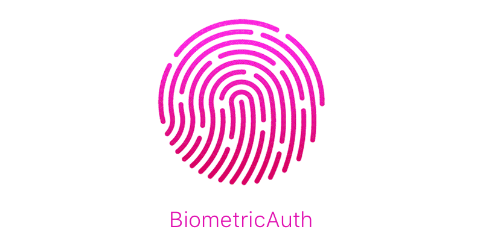

[](https://github.com/vasilenkoigor/BiometricAuth/releases) [](https://github.com/vasilenkoigor/BiometricAuth/releases) [](https://github.com/Carthage/Carthage)   [](https://raw.githubusercontent.com/vasilenkoigor/BiometricAuth/master/LICENSE)

- [Features](#features)
- [Requirements](#requirements)
- [Communication](#communication)
- [Installation](#installation)
- [Usage](#usage)
    - [Intro](#intro)
    - [Biometric authentication availability](#biometric-authentication-availability)
    - [Feature enabled/disabled for biometric authentication](#feature-availability-for-biometric-authentication)
    - [Authenticating](#authenticating)
- [License](#license)

## Features

- [x] Force failure authentication if was added new fingerprint to device. This feature for security considerations.
- [x] Saving features list that's needs authentication via TouchID

## Requirements

- iOS 9.0+ / macOS 10.12+
- Xcode 8.1+
- Swift 3.0+

## Communication

- If you **found a bug**, open an issue.
- If you **have a feature request**, open an issue.
- If you **want to contribute**, submit a pull request.

## Installation

### CocoaPods

[CocoaPods](http://cocoapods.org) is a dependency manager for Cocoa projects. You can install it with the following command:

```bash
$ gem install cocoapods
```

To integrate BiometricAuth into your Xcode project using CocoaPods, specify it in your `Podfile`:

```ruby
platform :ios, '9.0'
use_frameworks!

target '<Your Target Name>' do
    pod 'BiometricAuth'
end
```

Then, run the following command:

```bash
$ pod install
```

### Carthage

[Carthage](https://github.com/Carthage/Carthage) is a decentralized dependency manager that builds your dependencies and provides you with binary frameworks.

You can install Carthage with [Homebrew](http://brew.sh/) using the following command:

```bash
$ brew update
$ brew install carthage
```

To integrate BiometricAuth into your Xcode project using Carthage, specify it in your `Cartfile`:

```ogdl
github "vasilenkoigor/BiometricAuth"
```

Run `carthage update` to build the framework and drag the built `BiometricAuth.framework` into your Xcode project.

## Usage

### Intro

In security cosiderations strongly recommented enable `forceThrowsOnChangedDomainState`
```swift
let biometricAuth = BiometricAuth(forceThrowsOnChangedDomainState: true)
```

### Biometric authentication availability

```swift
do {
    try self.biometricAuth.isAvailable()
} catch let error as BiometricAuthError {
    print(error.localizedDescription)
} catch {
    print("Something went wrong")
}
```

### Feature enabled/disabled for biometric authentication

```swift
let feature = "Passcode Screen Auth"

do {
    try self.biometricAuth.enableAuthentication(forFeature: feature)
} catch let error as BiometricAuthError {
    print(error.localizedDescription)
} catch {
    print("Something went wrong")
}
```

### Authenticating

```swift
var success = false
        
do {
    success = try self.biometricAuth.requestAuthentication(forFeature: feature, reason: "For authentication")
} catch let error as BiometricAuthError {
    print(error.localizedDescription)
} catch {
    print("Something went wrong")
}
        
if success {
    print("Success biometric authentication")
}
```

## License

BiometricAuth is released under the MIT license. See LICENSE for details.
